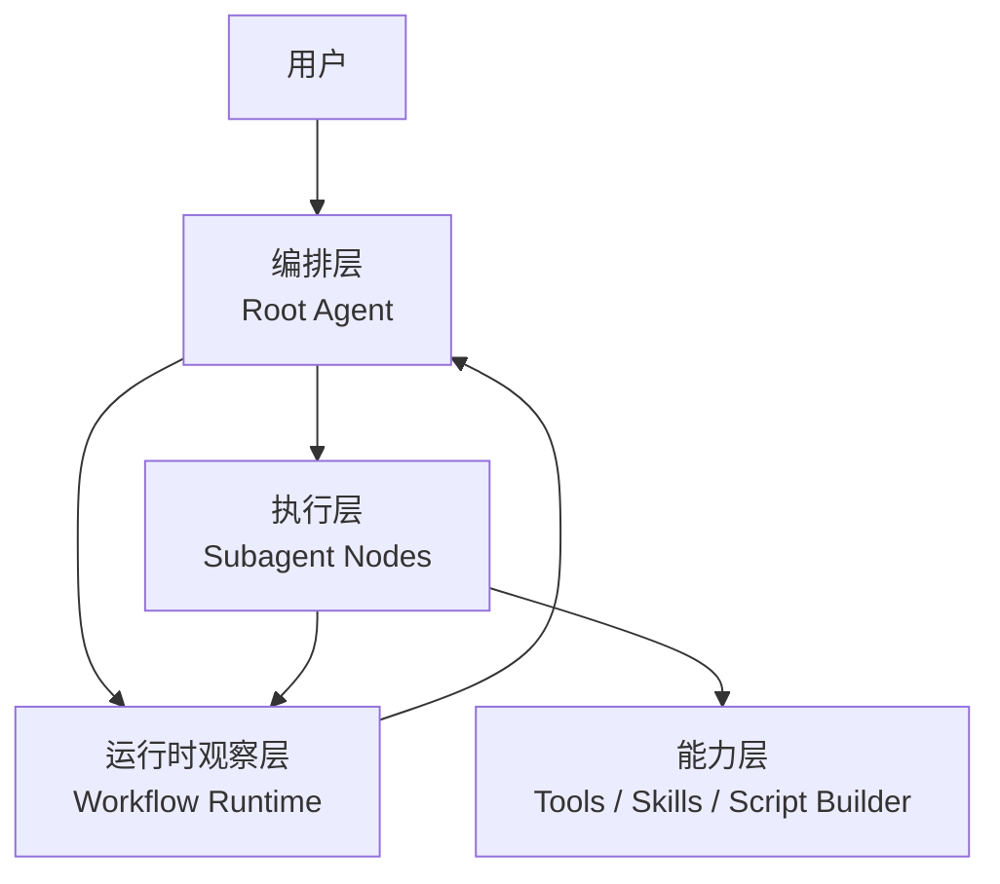

# 多 Agent Workflow 设计 README

本文档只描述当前 worktree 中基于 OpenCode 原生代码新增的多 Agent workflow 管理设计，不与 OpenCode 原生 README 混写。

本文档的目标是回答 3 个问题：

1. 这套多 Agent workflow 想解决什么问题
2. 整体架构如何分层
3. root agent 如何在最小上下文下稳定治理执行层

## 设计目标

| 目标 | 说明 |
| --- | --- |
| 避免人工设计复杂流程 | 用户只描述目标和约束，不手工画复杂 DAG |
| 上下文隔离 | 每个 subagent 独立 session，root 不消费完整子会话 |
| 避免执行层跑偏 | root 基于 runtime 和结构化摘要判断执行是否合理 |
| 提升长链任务可持续性 | 当任务卡住时，系统能定位阻塞点并决定补上下文、重试或改路由 |

## 核心原则

| 原则 | 说明 |
| --- | --- |
| 计划动态生成 | 计划由 root agent 生成和调整，不要求用户预先设计流程 |
| 编排执行分离 | root 负责治理，subagent 负责执行 |
| runtime 是事实源 | 判断依据来自 runtime、event、attempt report，而不是长文本 transcript |
| 最小必要上下文 | root 只读取治理所需摘要，不回灌完整子会话 |
| 先观测后决策 | 先把子执行投影成结构化状态，再由 root 决定继续、暂停、重试或终止 |

## 总体架构

当前建议采用四层架构：

1. 编排层
2. 运行时观察层
3. 执行层
4. 能力层

### 架构图

只保留抽象层关系，不展开具体节点和工具连线。

## 四层职责

| 层 | 角色 | 主要职责 | 不负责什么 |
| --- | --- | --- | --- |
| 编排层 | root agent / orchestrator | 理解目标、规划 plan、创建和调整 workflow、控制 run/restart/pause/stop、根据状态决定补上下文/重试/改路由/终止 | 不直接承担长链执行 |
| 运行时观察层 | workflow runtime | 持久化 workflow/node/edge/event/checkpoint，把 session 行为投影成 runtime summary 和 attempt report，负责 wake | 不替代 agent 做业务推理 |
| 执行层 | subagent nodes | 在隔离上下文中完成单一任务单元，调用能力层，产出结果和阻塞信息 | 不负责全局规划 |
| 能力层 | tools / skills / script builder | 为执行层提供代码、检索、构建、调试、验证、脚本生成等能力 | 不决定全局流程 |

## 角色分工

| 角色 | 典型职责 | 典型产出 |
| --- | --- | --- |
| `orchestrator` | 与用户交互、规划和治理 workflow | plan、node 调整、控制命令 |
| `coding` | 代码实现、局部验证 | 代码修改、diff、局部结果 |
| `debug` | 复现、诊断、定位异常 | fail reason、blocking reason、needs |
| `build-flash` | 构建、打包、烧录、验证 | 构建结果、运行结果、验证状态 |

## 用户交互边界

| 用户做什么 | 用户不做什么 |
| --- | --- |
| 提出目标 | 不手工设计 node graph |
| 确认 plan | 不直接管理子 session 细节 |
| 在 pause/阻塞时补充上下文 | 不手动绑定 subagent session |
| 通过前端控制 run/restart/stop/pause | 不逐条跟踪工具调用日志 |

## 运行流程

## 生命周期拆分

| 阶段 | root 关注点 | subagent 关注点 | runtime 关注点 |
| --- | --- | --- | --- |
| 规划阶段 | 目标、约束、拆分方式 | 无 | 尚未进入执行 |
| 确认阶段 | plan 是否可执行、模型路由是否合适 | 无 | workflow 进入可执行状态 |
| 执行阶段 | 是否需要继续拉起节点、是否需要等待 | 完成单一任务目标 | 持续记录状态、事件和增量 |
| 监督阶段 | 是否跑偏、是否缺上下文、是否应重试 | 提供结果和阻塞信息 | 生成 summary、wake、attempt report |
| 完成阶段 | 输出结果、是否需要追加动作 | 结束执行 | 保留 graph、session、diff、history |

## 为什么必须有运行时观察层

如果只有 root、subagent、tool 三层，系统会持续遇到这几类问题：

| 问题 | 后果 |
| --- | --- |
| root 不知道 subagent 做了什么 | 无法判断执行是否偏离目标 |
| root 不知道卡在哪里 | 无法决定补什么上下文 |
| root 不知道失败来自哪里 | 无法区分工具错误、skill 误用、环境缺失或任务拆分问题 |
| 长链任务没有统一状态源 | 暂停、恢复、重试很容易失控 |

所以 `runtime / observation layer` 不是附属功能，而是治理核心。

## Runtime 模型

### 核心实体

| 实体 | 作用 |
| --- | --- |
| `workflow` | 一次完整任务的全局执行单元 |
| `workflow_node` | 一个独立 subagent 执行单元 |
| `workflow_edge` | 节点依赖关系 |
| `workflow_checkpoint` | 可恢复或观察的中间状态 |
| `workflow_event` | 执行过程中的事实流 |

### Node 关键字段

| 字段 | 作用 |
| --- | --- |
| `status` | 当前执行状态 |
| `result_status` | 当前结果状态 |
| `fail_reason` | 失败原因 |
| `attempt` | 当前 attempt 次数 |
| `action_count` | 当前动作次数 |
| `max_attempts` | 最大尝试次数 |
| `max_actions` | 最大动作次数 |
| `session_id` | 对应 subagent session |
| `agent` | 节点 agent 类型 |
| `model` | 节点模型路由 |
| `state_json` | 扩展状态数据 |
| `result_json` | 扩展结果数据 |

### Workflow Snapshot 关键聚合字段

| 字段 | 作用 |
| --- | --- |
| `phase` | 当前 workflow 所处阶段 |
| `active_node_id` | 当前活跃节点 |
| `waiting_node_ids` | 当前等待节点 |
| `failed_node_ids` | 当前失败节点 |
| `command_count` | 控制命令数量 |
| `update_count` | 节点更新次数 |
| `pull_count` | 拉取次数 |
| `last_event_id` | 最近事件位置 |

## 当前已实现能力

| 能力 | 当前状态 |
| --- | --- |
| workflow / node / edge / checkpoint / event 持久化 | 已实现 |
| root session 绑定 workflow | 已实现 |
| node 绑定 session | 已实现 |
| `workflow.read` 增量读取 | 已实现 |
| `workflow.control` 控制命令 | 已实现 |
| node 级 code changes 查询 | 已实现 |
| root UI graph / node detail / session detail 跳转 | 已实现 |
| root 模型选择接入执行链路 | 已实现 |
| 工具调用状态显示动画接入真实 runtime | 已实现 |
| 工作区切换和新建 task | 已实现 |

## 当前前端管理方式

| 模块 | 作用 |
| --- | --- |
| Graph 视图 | 展示 workflow、root、node 状态 |
| Inspector | 展示 node 状态、model、result、code changes、execution log |
| Session View | 点击 node 后进入对应 session detail |
| Root Chat | 直接向 orchestrator 发消息 |
| 顶部控制区 | 触发 run / restart / stop / pause |
| Task Sidebar | 浏览和切换 task，创建新 task |

## Attempt Report

### 设计目标

让 root 在不读取完整子会话的前提下，知道：

1. subagent 这一轮在试图完成什么
2. subagent 当前需要什么
3. 这些需要是 root 能补，还是必须让用户补
4. 这一轮 attempt 的执行过程是否围绕正确目标展开
5. 当前结果如何，以及为什么失败或等待

### 最关键的字段信息

| 字段信息 | 作用 | root 如何使用 |
| --- | --- | --- |
| `result` | 本轮结果，例如成功、失败、部分完成、等待 | 判断是否继续推进、重试或终止 |
| `summary` | 极短结论摘要 | 快速理解本轮发生了什么 |
| `needs` | 缺少的上下文、输入、资源、决策 | 判断 root 能否直接补充；如果不能，则转为用户输入 |
| `actions` | 本轮为了什么目标做了哪些关键动作，以及结果如何 | 判断 attempt 的执行链是否合理、是否跑偏 |
| `errors` | 失败点和阻塞点 | 判断是否可恢复、是否应改路由或改 plan |

### 两个核心问题

#### 1. subagent 需要什么

这是治理里最关键的问题。

`needs` 不应该只是罗列缺失项，而应该支持 root 做二次判断：

| need 类型 | root 是否应自己处理 | 典型动作 |
| --- | --- | --- |
| 上下文缺失 | 可以 | root 补充背景、上游结果、路径、约束 |
| 路由或 plan 不清晰 | 可以 | root 改 plan、改模型路由、改 agent 类型 |
| 用户业务决策缺失 | 不可以 | root 暂停并请求用户确认 |
| 外部资源或权限缺失 | 视情况而定 | root 判断是否能替换路径、切工作区或提示用户处理 |

也就是说，attempt report 不是单纯汇报“缺什么”，而是要让 root 能回答：

1. 这个缺口我能不能补
2. 如果我不能补，是不是必须转给用户

#### 2. attempt 的执行流程是否合理

`actions` 的重点不是记录“调了哪些工具”，而是让 root 判断：

1. subagent 本轮是在试图完成哪个目标
2. 为了这个目标用了哪些能力
3. 这些动作是否真的支撑了目标
4. 当前执行链是否已经跑偏

也就是说，attempt report 的价值不在于“工具调用清单”，而在于“目标导向的执行链摘要”。

### 生成策略

| 部分 | 生成方式 |
| --- | --- |
| `actions / errors` | 由 runtime 根据 tool、skill、subtask、diff 等事实自动投影 |
| `summary / needs` | 由 subagent 在回合结束时轻量补充，避免长文本 |

### 为什么不保留具体结构定义

当前最重要的不是先固定一份复杂 schema，而是先保证治理语义正确：

1. root 能知道 subagent 需要什么
2. root 能判断这些需要是否应由自己补充，还是必须转给用户
3. root 能知道这一轮 attempt 的执行链是否合理
4. root 能据此做继续、暂停、补上下文、重试、改路由或终止决策

## Wake 与治理事件

runtime 不应该在每个细节变化上都打断 root，而应该在关键语义事件上唤醒。

| 事件类别 | 用途 |
| --- | --- |
| `node.completed` | 节点完成，root 决定后续节点或结束 |
| `node.failed` | 节点失败，root 判断重试、改路由或终止 |
| `node.waiting` | 节点等待输入，root 判断是否补上下文 |
| `node.blocked` | 节点被阻塞，root 判断是否需要外部条件 |
| `node.stalled` | 节点长时间无推进，root 判断是否需要介入 |
| `node.action_limit_reached` | 动作次数打满，root 需要做治理决策 |
| `node.attempt_limit_reached` | 尝试次数打满，root 需要终止或改 plan |
| `node.attempt_reported` | 一轮 attempt 摘要已生成，root 可以做更细的治理判断 |

## Root 治理决策表

| 观察到的信号 | root 应重点判断 | 典型动作 |
| --- | --- | --- |
| `result=success` | 节点目标是否已满足 | 推进后续节点 |
| `result=partial` | 是否已具备继续推进条件 | 继续执行或补局部上下文 |
| `result=waiting` | `needs` 是否需要用户确认或上游产物 | pause、请求补充信息 |
| `result=fail` 且 `recoverable=true` | 是否适合局部重试 | retry、inject context、reroute |
| `result=fail` 且 `recoverable=false` | 是否需要回退 plan | fail fast、请求用户决策 |
| `stalled / limit reached` | 当前拆分和路由是否合理 | 改 plan、换 agent、终止 |

## 为什么这套设计能解决四个核心问题

| 问题 | 对应机制 |
| --- | --- |
| 避免人工设计复杂流程 | root 动态规划，用户只确认目标和方向 |
| 上下文隔离 | 每个 node 独立 session，root 只读结构化摘要 |
| 避免执行层跑偏 | root 依据 `goal -> outcome -> needs -> errors` 做治理 |
| 改善长链任务推进 | runtime 持续提供状态、阻塞点和 wake 事件 |

## 后续实现建议

| 阶段 | 重点 |
| --- | --- |
| 第一阶段 | 完善 node runtime summary 和 attempt report 存储 |
| 第二阶段 | 让 root 基于 attempt report 自动做 retry / inject context / reroute |
| 第三阶段 | 补齐脚本工具生成能力、验证模板和评估模板 |

## 当前限制

| 限制 | 说明 |
| --- | --- |
| runtime 观测仍偏粗 | 某些 skill / tool / subtask 仍未完全统一为摘要 |
| attempt report 仍需继续强化 | `summary / needs` 还可以更显式、更稳定 |
| 工具层尚未完整 | 自动脚本生成和标准验证模板还未补齐 |

## 一句话总结

这套多 Agent workflow 的核心，不是把任务拆成更多 agent，而是让 root agent 在最小必要上下文下，基于真实 runtime 和结构化 attempt report，持续判断执行层是否沿着正确目标推进。
