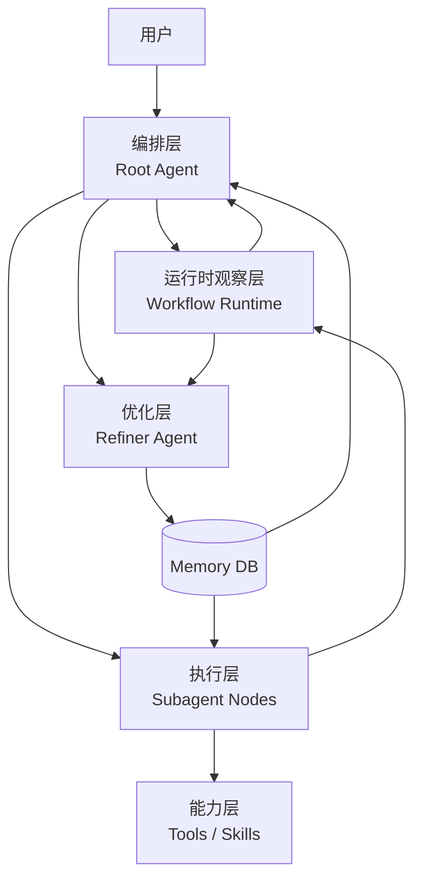
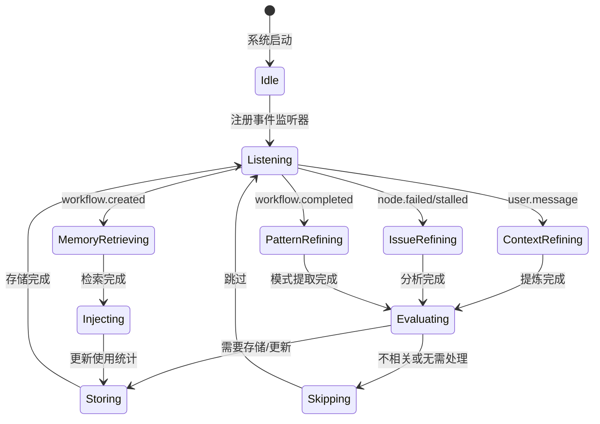

# 优化层 Refiner Agent 设计文档

## 一、架构定位

### 1.1 五层架构全景

在现有四层架构基础上，新增第五层——**优化层**：



### 1.2 优化层职责

| 职责              | 说明                                 | 触发时机                           |
| ----------------- | ------------------------------------ | ---------------------------------- |
| 上下文记忆提炼    | 从用户补充和执行过程中提炼可复用记忆 | 用户输入、node 状态变化            |
| 问题模式记录      | 记录失败原因和解决方案               | node.failed、attempt_limit_reached |
| Workflow 模式固化 | 将成功的 workflow 结构保存为模板     | workflow.completed                 |
| 记忆检索注入      | 为新 workflow 推荐相关记忆和配置     | workflow_create 前                 |

### 1.3 与其他层的关系

| 交互方    | 数据流向 | 内容                                  |
| --------- | -------- | ------------------------------------- |
| 编排层    | 双向     | 接收提炼后的记忆，提供历史模式推荐    |
| 运行时层  | 单向接收 | 监听 workflow/node event 获取执行事实 |
| 执行层    | 单向接收 | 接收 attempt report 中的 needs/errors |
| Memory DB | 双向     | 存储和检索记忆数据                    |

---

## 二、Refiner Agent 核心设计

### 2.1 Agent 定义

```typescript
// packages/opencode/src/agent/refiner.ts
interface RefinerAgent {
  id: "refiner"
  mode: "system" // 系统级 Agent，不直接对用户
  triggers: TriggerRule[]
  capabilities: RefinementCapability[]
}
```

### 2.2 三种提炼模式

#### 模式 A：用户上下文提炼 (ContextRefiner)

**触发条件**：用户在 root session 中补充上下文

**处理流程**：

```
用户输入 → 判断是否与 workflow 相关 → 提炼记忆 → 存储/更新 DB
```

**判断规则**：

```typescript
interface ContextRelevanceCheck {
  // 1. 是否包含 workflow 相关关键词
  hasWorkflowKeywords: boolean // 如"提交"、"构建"、"验证"、"推送"等

  // 2. 是否描述执行动作或约束
  describesActionOrConstraint: boolean

  // 3. 是否与当前活跃 workflow 的任务类型匹配
  matchesActiveWorkflowType: boolean

  // 4. 是否提供了新的工具/skill 使用方式
  introducesNewToolUsage: boolean

  // 综合判断
  isRelevant: boolean // 以上任意 2 项为 true
}
```

**提炼输出**：

```typescript
interface RefinedContext {
  // 原始上下文摘要
  originalSummary: string

  // 提炼后的记忆（简洁表述）
  refinedMemory: string // 如："代码完成后需 git 提交，推送到 gerrit，触发 jenkins 构建验证"

  // 任务类型
  taskType: TaskType // 见 3.2 节

  // 与 workflow 的关系
  workflowRelation: {
    phase: string // 如 "post-coding", "pre-build", "verification"
    position: "before" | "after" | "during"
    targetNode: string // 关联的 node agent 类型
  }

  // 涉及的 skills/tools
  requiredSkills: string[] // 如 ["gerrit", "jenkins"]
  requiredTools: string[]

  // 环境变量或配置
  envVars: Record<string, string>
  workingDir?: string
}
```

#### 模式 B：执行问题提炼 (IssueRefiner)

**触发条件**：node.failed、node.stalled、node.attempt_limit_reached

**处理流程**：

```
执行失败 → 分析 attempt report → 判断缺失类型 → 记录问题模式
```

**判断规则**：

```typescript
interface IssueClassification {
  // 从 attempt report 的 needs 字段分析
  needType: "context" | "tool" | "skill" | "permission" | "environment" | "decision"

  // 是否可通过补充上下文解决
  isContextMissing: boolean

  // 是否缺少工具或 skill
  isToolMissing: boolean

  // 补充后是否成功（用于验证记忆有效性）
  resolvedAfterSupplement?: boolean

  // 问题模式摘要
  issuePattern: string // 如："coding agent 缺少目标分支信息导致 push 失败"

  // 解决方案
  solution: string // 如："在 node config 中注入 upstream_branch 参数"
}
```

**提炼输出**：

```typescript
interface RefinedIssue {
  // 问题分类
  category: IssueCategory

  // 问题描述
  description: string

  // 根因分析
  rootCause: string

  // 解决方案
  solution: string

  // 涉及的 agent 类型
  affectedAgents: string[]

  // 缺失的 NEED 类型
  missingNeeds: NeedType[]

  // 解决该问题需要的配置
  requiredConfig: Record<string, unknown>

  // 验证状态（后续 workflow 是否成功复用）
  validationStatus: "unverified" | "verified" | "failed"
}
```

#### 模式 C：Workflow 模式固化 (PatternRefiner)

**触发条件**：workflow.completed 且 result_status = "success"

**处理流程**：

```
workflow 完成 → 分析 graph 结构 → 提取成功模式 → 存储为模板
```

**提炼输出**：

```typescript
interface WorkflowPattern {
  // 模式名称
  name: string

  // 任务类型
  taskType: TaskType

  // 节点序列（抽象化，去除具体 session_id）
  nodeSequence: {
    agent: string
    title: string
    position: number
    config: Record<string, unknown> // 关键配置参数
    checkpoints: string[]
  }[]

  // 节点间依赖关系
  edges: {
    from: string // agent 类型
    to: string
    label: string
  }[]

  // 成功关键因素
  successFactors: string[]

  // 常见陷阱
  commonPitfalls: string[]

  // 推荐模型路由
  recommendedModels: {
    [agent: string]: { providerID: string; modelID: string }
  }

  // 使用次数统计
  usageCount: number
  successRate: number
}
```

---

## 二.3 判断逻辑详解

### 2.3.1 用户上下文相关性判断决策树

当用户补充上下文时，Refiner Agent 需要判断是否与当前 workflow 相关：

```
用户输入
  │
  ├─ 1. 是否包含 workflow 关键词？
  │    ├─ 是 → 标记 keyword_match = true
  │    └─ 否 → 继续判断
  │
  ├─ 2. 是否描述执行动作或约束？
  │    ├─ 是 → 标记 action_constraint = true
  │    └─ 否 → 继续判断
  │
  ├─ 3. 是否与当前活跃 workflow 的任务类型匹配？
  │    ├─ 是 → 标记 task_type_match = true
  │    └─ 否 → 继续判断
  │
  ├─ 4. 是否引入了新的工具/skill 使用方式？
  │    ├─ 是 → 标记 new_tool_usage = true
  │    └─ 否 → 继续判断
  │
  └─ 5. 综合判断：
       ├─ 以上任意 2 项为 true → 相关，进入提炼流程
       └─ 否则 → 跳过，记录日志
```

**示例判断过程**：

| 用户输入                          | keyword_match        | action_constraint | task_type_match     | new_tool_usage | 结果                 |
| --------------------------------- | -------------------- | ----------------- | ------------------- | -------------- | -------------------- |
| "修改后请帮我做提交"              | ✅ (提交)            | ✅ (描述动作)     | ✅ (coding 任务)    | ❌             | **相关** (3 项 true) |
| "后续提交到 gerrit，jenkins 验证" | ✅ (gerrit, jenkins) | ✅ (描述流程)     | ✅ (firmware_build) | ✅ (新工具链)  | **相关** (4 项 true) |
| "今天天气不错"                    | ❌                   | ❌                | ❌                  | ❌             | **跳过** (0 项 true) |
| "代码风格用 prettier"             | ✅ (代码)            | ✅ (约束)         | ❌ (可能不匹配)     | ✅ (新工具)    | **相关** (3 项 true) |

### 2.3.2 任务执行缺失判断逻辑

当执行层 Agent 失败时，Refiner Agent 需要分析缺失类型：

```typescript
interface NeedClassification {
  // 从 attempt report 的 needs 字段分析
  needs: Array<{
    type: "context" | "tool" | "skill" | "permission" | "environment" | "decision"
    description: string
    canBeSupplementedBy: "root" | "user" | "tool_agent" | "system"
    priority: "high" | "medium" | "low"
  }>

  // 缺失类型统计
  missingContextCount: number
  missingToolCount: number
  missingSkillCount: number

  // 判断主要缺失类型
  primaryMissingType: "context" | "tool" | "skill" | "mixed"

  // 处理建议
  recommendation: {
    action: "supplement_context" | "update_tool" | "install_skill" | "request_user_input"
    target: string // root agent, tool agent, user, etc.
    details: string
  }
}
```

**判断规则**：

| 缺失类型   | 判断依据                               | 处理动作             | 负责方            |
| ---------- | -------------------------------------- | -------------------- | ----------------- |
| 上下文缺失 | needs 中包含路径、配置、约束等信息缺失 | 补充上下文后重试     | Root Agent        |
| 工具缺失   | needs 中包含工具未安装、命令不存在     | 启动 Tool Agent 更新 | Tool Agent        |
| Skill 缺失 | needs 中包含 skill 未配置、流程不熟悉  | 记录并更新 skill     | Tool Agent        |
| 权限缺失   | needs 中包含权限不足、认证失败         | 请求用户提供         | User              |
| 环境缺失   | needs 中包含环境变量、依赖缺失         | 记录并更新环境配置   | System/Tool Agent |
| 决策缺失   | needs 中包含需要用户确认的业务决策     | 暂停并请求用户       | User              |

### 2.3.3 Tool Agent 设计

Tool Agent 是专门负责工具链维护和更新的系统级 Agent：

```typescript
interface ToolAgent {
  id: "tool-agent"
  mode: "system"
  capabilities: {
    // 工具安装和更新
    installTool: (toolName: string, version?: string) => Promise<InstallResult>
    updateTool: (toolName: string) => Promise<UpdateResult>

    // Skill 配置和更新
    configureSkill: (skillName: string, config: Record<string, unknown>) => Promise<void>
    updateSkill: (skillName: string) => Promise<void>

    // 环境配置
    setupEnvironment: (envVars: Record<string, string>) => Promise<void>
    installDependencies: (packageManager: string, packages: string[]) => Promise<void>

    // 工具验证
    verifyTool: (toolName: string) => Promise<VerificationResult>
    testSkill: (skillName: string) => Promise<TestResult>
  }
}
```

**Tool Agent 触发时机**：

| 触发条件     | 来源                                    | 处理动作          |
| ------------ | --------------------------------------- | ----------------- |
| 工具未安装   | IssueRefiner 检测到 tool_missing        | 安装工具并验证    |
| Skill 未配置 | IssueRefiner 检测到 skill_missing       | 配置 skill 并测试 |
| 环境依赖缺失 | IssueRefiner 检测到 environment_missing | 安装依赖并验证    |
| 工具版本过旧 | PatternRefiner 检测到版本不匹配         | 更新工具并验证    |
| 新工具链引入 | ContextRefiner 检测到新工具使用方式     | 安装并配置工具链  |

**Tool Agent 工作流程**：

```
Refiner Agent 检测到工具缺失
  │
  ├─ 1. 分类缺失类型
  │    ├─ 工具未安装 → installTool
  │    ├─ Skill 未配置 → configureSkill
  │    └─ 环境依赖缺失 → installDependencies
  │
  ├─ 2. 执行安装/配置
  │    └─ 记录执行日志
  │
  ├─ 3. 验证安装结果
  │    ├─ 验证工具可用性 → verifyTool
  │    └─ 测试 skill 功能 → testSkill
  │
  └─ 4. 更新 Memory DB
       ├─ 记录工具安装状态
       ├─ 更新相关 workflow 配置
       └─ 标记问题为 resolved
```

---

## 三、Task 类型 AI 归类机制

### 3.1 Task 类型分类体系

Refiner Agent 使用多层分类体系来识别和归类任务类型：

```typescript
interface TaskTypeClassifier {
  // 一级分类（粗粒度）
  primaryCategory: "development" | "operations" | "documentation" | "testing" | "analysis"

  // 二级分类（细粒度）
  secondaryCategory: TaskType // 见下方枚举

  // 分类置信度
  confidence: number // 0-1

  // 分类依据
  reasoning: {
    keywords: string[]
    patterns: string[]
    context: string[]
  }
}

// 任务类型枚举（扩展版）
export const TASK_TYPES = {
  // 开发类
  feature_development: "功能开发",
  bug_fix: "缺陷修复",
  refactoring: "代码重构",
  api_development: "API 开发",
  ui_development: "UI 开发",

  // 运维类
  firmware_build: "固件构建",
  deployment: "部署发布",
  environment_setup: "环境配置",
  ci_cd_pipeline: "CI/CD 流水线",

  // 文档类
  documentation: "文档编写",
  blog_writing: "博客撰写",
  requirement_report: "需求报告",
  form_filling: "单据填写",

  // 测试类
  performance_testing: "性能测试",
  unit_testing: "单元测试",
  integration_testing: "集成测试",
  firmware_validation: "固件验证",

  // 分析类
  code_review: "代码审查",
  log_analysis: "日志分析",
  root_cause_analysis: "根因分析",
} as const
```

### 3.2 AI 归类算法

```typescript
// packages/opencode/src/refiner/classifier.ts

interface TaskClassificationResult {
  taskType: TaskType
  confidence: number
  reasoning: string[]
  alternativeTypes: Array<{ type: TaskType; confidence: number }>
}

async function classifyTaskType(
  userInput: string,
  workflowContext: WorkflowSnapshot,
  history: MemoryRecord[],
): Promise<TaskClassificationResult> {
  // Step 1: 关键词匹配（快速初筛）
  const keywordMatches = matchTaskKeywords(userInput)

  // Step 2: 语义匹配（LLM 辅助判断）
  const semanticResult = await llmClassifyTask({
    input: userInput,
    workflowContext: {
      taskType: workflowContext.taskType,
      agents: workflowContext.agents,
      nodes: workflowContext.nodes,
    },
    history: history.slice(0, 10), // 最近 10 条记忆
  })

  // Step 3: 上下文关联（参考当前 workflow 类型）
  const contextScore = workflowContext.taskType ? 0.3 : 0

  // Step 4: 历史模式匹配（参考相似任务）
  const historyMatches = findSimilarTasksInHistory(userInput, history)

  // Step 5: 综合判断
  const finalResult = combineClassificationResults({
    keywordMatches,
    semanticResult,
    contextScore,
    historyMatches,
  })

  return finalResult
}

// 关键词映射表
const TASK_KEYWORDS = {
  feature_development: ["实现", "开发", "新增", "功能", "feature", "implement"],
  bug_fix: ["修复", "bug", "缺陷", "错误", "fix", "patch"],
  firmware_build: ["编译", "构建", "固件", "build", "compile", "firmware"],
  deployment: ["部署", "发布", "上线", "deploy", "release", "publish"],
  documentation: ["文档", "说明", "手册", "doc", "manual", "guide"],
  // ... 更多映射
}
```

### 3.3 归类示例

| 用户输入                          | 一级分类      | 二级分类            | 置信度 | 判断依据                        |
| --------------------------------- | ------------- | ------------------- | ------ | ------------------------------- |
| "帮我实现用户登录功能"            | development   | feature_development | 0.92   | 关键词"实现"+"功能"             |
| "修复登录页面的样式问题"          | development   | bug_fix             | 0.88   | 关键词"修复"+"问题"             |
| "编译固件并烧录到设备"            | operations    | firmware_build      | 0.95   | 关键词"编译"+"固件"+"烧录"      |
| "写一份 API 接口文档"             | documentation | documentation       | 0.90   | 关键词"文档"+"API"              |
| "提交到 gerrit 并在 jenkins 构建" | operations    | ci_cd_pipeline      | 0.87   | 关键词"gerrit"+"jenkins"+"构建" |

---

## 四、Memory 数据库设计

### 3.1 Schema 总览

使用 Drizzle ORM 在 SQLite 上定义，新增 4 张表：

```
workflow_memory      - 提炼后的记忆记录
workflow_pattern     - 成功的 workflow 模式模板
workflow_issue       - 问题模式和解决方案
context_rule         - 用户上下文规则
```

### 3.2 表结构定义

#### 表 1：workflow_memory

存储提炼后的上下文记忆。

```typescript
// packages/opencode/src/refiner/memory.sql.ts
import { sqliteTable, text, integer } from "drizzle-orm/sqlite-core"

export const workflowMemoryTable = sqliteTable("workflow_memory", {
  id: text().primaryKey(),

  // 记忆类型
  memory_type: text().notNull(), // "context" | "issue" | "pattern"

  // 任务类型分类
  task_type: text().notNull(), // 见下方枚举

  // 记忆内容（提炼后的简洁表述）
  content: text().notNull(),

  // 原始上下文摘要（用于追溯）
  original_context: text(),

  // 关联的 workflow_id（如果有）
  workflow_id: text(),

  // 涉及的 agent 类型
  agents: text().notNull(), // JSON array: ["coding", "build-flash"]

  // 涉及的 skills/tools
  skills: text(), // JSON array
  tools: text(), // JSON array

  // 环境变量
  env_vars: text(), // JSON object

  // 工作目录
  working_dir: text(),

  // 记忆来源
  source: text().notNull(), // "user_input" | "execution_failure" | "workflow_completion"

  // 置信度（基于使用次数和成功率）
  confidence: integer().notNull().default(50), // 0-100

  // 使用统计
  usage_count: integer().notNull().default(0),
  success_count: integer().notNull().default(0),

  // 时间戳
  created_at: integer().notNull(),
  updated_at: integer().notNull(),

  // 是否激活
  is_active: integer().notNull().default(1), // 0 or 1
})

// 任务类型枚举
export const TASK_TYPES = [
  "feature_development", // 功能开发
  "bug_fix", // 缺陷修复
  "form_filling", // 单据填写
  "requirement_report", // 需求报告
  "blog_writing", // 博客撰写
  "performance_testing", // 性能测试
  "firmware_build", // 固件构建
  "code_review", // 代码审查
  "documentation", // 文档编写
  "deployment", // 部署发布
] as const
```

#### 表 2：workflow_pattern

存储成功的 workflow 模式模板。

```typescript
export const workflowPatternTable = sqliteTable("workflow_pattern", {
  id: text().primaryKey(),

  // 模式名称
  name: text().notNull(),

  // 任务类型
  task_type: text().notNull(),

  // 模式描述
  description: text().notNull(),

  // 节点定义（抽象化）
  nodes: text().notNull(), // JSON: [{agent, title, position, config, checkpoints}]

  // 边定义
  edges: text().notNull(), // JSON: [{from, to, label}]

  // 检查点定义
  checkpoints: text(), // JSON: [{node_id, label, status}]

  // 成功因素
  success_factors: text(), // JSON array

  // 常见陷阱
  common_pitfalls: text(), // JSON array

  // 推荐模型路由
  recommended_models: text(), // JSON: {agent: {providerID, modelID}}

  // 配置模板
  config_template: text(), // JSON object

  // 统计
  usage_count: integer().notNull().default(0),
  success_count: integer().notNull().default(0),
  avg_actions_per_node: text(), // JSON: {agent: avg_count}

  // 时间戳
  created_at: integer().notNull(),
  updated_at: integer().notNull(),

  // 是否推荐
  is_recommended: integer().notNull().default(0),
})
```

#### 表 3：workflow_issue

记录问题模式和解决方案。

```typescript
export const workflowIssueTable = sqliteTable("workflow_issue", {
  id: text().primaryKey(),

  // 问题分类
  category: text().notNull(), // "context_missing" | "tool_missing" | "skill_missing" | "permission" | "environment" | "decision"

  // 任务类型
  task_type: text().notNull(),

  // 问题描述
  description: text().notNull(),

  // 根因分析
  root_cause: text().notNull(),

  // 解决方案
  solution: text().notNull(),

  // 涉及的 agent
  affected_agents: text().notNull(), // JSON array

  // 缺失的 NEED 类型
  missing_needs: text().notNull(), // JSON array

  // 解决所需配置
  required_config: text(), // JSON object

  // 验证状态
  validation_status: text().notNull().default("unverified"), // "unverified" | "verified" | "failed"

  // 关联的 workflow_id
  workflow_id: text(),
  node_id: text(),

  // 时间戳
  created_at: integer().notNull(),
  resolved_at: integer(),
})
```

#### 表 4：context_rule

存储用户上下文规则（长期有效的约束）。

```typescript
export const contextRuleTable = sqliteTable("context_rule", {
  id: text().primaryKey(),

  // 规则名称
  name: text().notNull(),

  // 规则描述
  description: text().notNull(),

  // 规则类型
  rule_type: text().notNull(), // "commit_format" | "build_process" | "deployment" | "code_style" | "review_process"

  // 规则内容
  content: text().notNull(),

  // 适用任务类型
  applicable_task_types: text(), // JSON array

  // 适用 agent 类型
  applicable_agents: text(), // JSON array

  // 优先级
  priority: integer().notNull().default(50), // 0-100

  // 是否激活
  is_active: integer().notNull().default(1),

  // 时间戳
  created_at: integer().notNull(),
  updated_at: integer().notNull(),
})
```

---

## 四、上下文提炼逻辑

### 4.1 相关性判断引擎

```typescript
// packages/opencode/src/refiner/relevance.ts

interface RelevanceScorer {
  // 关键词匹配权重
  keywordWeight: number // 默认 0.3

  // 语义匹配权重
  semanticWeight: number // 默认 0.4

  // 上下文关联权重
  contextWeight: number // 默认 0.3
}

function calculateRelevance(
  userInput: string,
  activeWorkflow: WorkflowSnapshot,
  scorer: RelevanceScorer = defaultScorer,
): RelevanceResult {
  // 1. 关键词匹配
  const keywordScore = matchWorkflowKeywords(userInput)

  // 2. 语义匹配（使用 embedding 或 LLM 判断）
  const semanticScore = await assessSemanticRelevance(userInput, activeWorkflow)

  // 3. 上下文关联（是否与当前节点任务相关）
  const contextScore = assessContextRelation(userInput, activeWorkflow.activeNodes)

  // 加权计算
  const totalScore =
    keywordScore * scorer.keywordWeight + semanticScore * scorer.semanticWeight + contextScore * scorer.contextWeight

  return {
    score: totalScore,
    isRelevant: totalScore >= 0.6, // 阈值可配置
    breakdown: { keywordScore, semanticScore, contextScore },
  }
}

// 关键词库
const WORKFLOW_KEYWORDS = [
  // 构建相关
  "构建",
  "编译",
  "build",
  "compile",
  "package",
  // 提交相关
  "提交",
  "commit",
  "push",
  "gerrit",
  "merge",
  // 验证相关
  "验证",
  "测试",
  "test",
  "verify",
  "validate",
  "jenkins",
  // 部署相关
  "部署",
  "deploy",
  "发布",
  "release",
  "flash",
  // 代码相关
  "代码",
  "code",
  "实现",
  "implement",
  "修复",
  "fix",
  // 流程相关
  "流程",
  "流程",
  "步骤",
  "step",
  "顺序",
  "order",
]
```

### 4.2 记忆提炼流程

```typescript
// packages/opencode/src/refiner/refine.ts

async function refineUserContext(userInput: string, workflow: WorkflowSnapshot): Promise<RefinedContext> {
  // Step 1: 判断相关性
  const relevance = calculateRelevance(userInput, workflow)
  if (!relevance.isRelevant) {
    return { skip: true, reason: "与当前 workflow 无关" }
  }

  // Step 2: 识别任务类型
  const taskType = classifyTaskType(userInput, workflow)

  // Step 3: 提炼与 workflow 的关系
  const relation = extractWorkflowRelation(userInput, workflow)

  // Step 4: 识别涉及的 skills/tools
  const skills = extractRequiredSkills(userInput)
  const tools = extractRequiredTools(userInput)

  // Step 5: 生成简洁记忆
  const refinedMemory = await generateRefinedMemory({
    original: userInput,
    taskType,
    relation,
    skills,
    tools,
  })

  return {
    skip: false,
    refinedMemory,
    taskType,
    workflowRelation: relation,
    requiredSkills: skills,
    requiredTools: tools,
  }
}
```

### 4.3 提炼示例

#### 示例 1：用户补充提交要求

**用户输入**：

> 修改后请帮我做提交，提交格式符合：
> 【问题原因】xxxx
> 【提交说明】xxxx

**提炼结果**：

```json
{
  "refinedMemory": "代码修改完成后需执行 git commit，提交信息包含【问题原因】和【提交说明】两个段落",
  "taskType": "feature_development",
  "workflowRelation": {
    "phase": "post-coding",
    "position": "after",
    "targetNode": "coding"
  },
  "requiredSkills": ["git"],
  "requiredTools": ["bash"],
  "contextRule": {
    "name": "commit_format_requirement",
    "type": "commit_format",
    "content": "提交信息必须包含【问题原因】和【提交说明】两个段落"
  }
}
```

#### 示例 2：用户补充构建流程

**用户输入**：

> 后续提交到 gerrit 上，并在 jenkins 上编译验证固件

**提炼结果**：

```json
{
  "refinedMemory": "代码提交到 gerrit 后，触发 jenkins 构建 job 验证固件",
  "taskType": "firmware_build",
  "workflowRelation": {
    "phase": "post-commit",
    "position": "after",
    "targetNode": "build-flash"
  },
  "requiredSkills": ["gerrit", "jenkins"],
  "requiredTools": ["bash"],
  "contextRule": {
    "name": "gerrit_jenkins_pipeline",
    "type": "build_process",
    "content": "提交到 gerrit → 触发 jenkins job → 构建验证固件"
  }
}
```

---

## 五、触发机制和生命周期

### 5.1 触发事件矩阵

| 触发事件                     | 来源         | 提炼模式        | 处理动作               |
| ---------------------------- | ------------ | --------------- | ---------------------- |
| `user.message`               | Root Session | ContextRefiner  | 判断相关性，提炼记忆   |
| `node.failed`                | Runtime      | IssueRefiner    | 分析失败原因，记录问题 |
| `node.stalled`               | Runtime      | IssueRefiner    | 分析停滞原因           |
| `node.attempt_limit_reached` | Runtime      | IssueRefiner    | 记录达到上限的问题     |
| `node.completed`             | Runtime      | PatternRefiner  | 记录成功模式           |
| `workflow.completed`         | Runtime      | PatternRefiner  | 固化完整 workflow 模式 |
| `workflow.created`           | Runtime      | MemoryRetriever | 检索相关记忆并注入     |

### 5.2 Refiner Agent 生命周期



### 5.3 事件监听实现

```typescript
// packages/opencode/src/refiner/listener.ts

export function startRefinerListener() {
  // 监听用户消息
  bus.subscribe("user.message", async (event) => {
    const workflow = getActiveWorkflow(event.projectID)
    if (!workflow) return

    const result = await refineUserContext(event.message, workflow)
    if (!result.skip) {
      await storeMemory(result)
    }
  })

  // 监听节点失败
  bus.subscribe("node.failed", async (event) => {
    const attemptReport = await getAttemptReport(event.nodeID)
    const issue = await refineIssue(event, attemptReport)
    await storeIssue(issue)
  })

  // 监听 workflow 完成
  bus.subscribe("workflow.completed", async (event) => {
    const workflow = await getWorkflow(event.workflowID)
    if (workflow.result_status === "success") {
      const pattern = await extractWorkflowPattern(workflow)
      await storePattern(pattern)
    }
  })

  // 监听 workflow 创建（用于记忆检索）
  bus.subscribe("workflow.created", async (event) => {
    const memories = await retrieveRelevantMemories(event.taskType)
    if (memories.length > 0) {
      await injectMemoriesToWorkflow(event.workflowID, memories)
    }
  })
}
```

---

## 六、记忆检索和使用机制

### 6.1 检索策略

```typescript
// packages/opencode/src/refiner/retriever.ts

interface MemoryRetriever {
  // 检索相关记忆
  retrieve(context: RetrievalContext): Promise<MemoryMatch[]>

  // 检索成功模式
  retrievePatterns(taskType: string): Promise<WorkflowPattern[]>

  // 检索已知问题
  retrieveIssues(taskType: string, agents: string[]): Promise<WorkflowIssue[]>

  // 检索上下文规则
  retrieveRules(taskType: string, agents: string[]): Promise<ContextRule[]>
}

interface RetrievalContext {
  taskType: string
  agents: string[]
  keywords: string[]
  workingDir?: string
}

interface MemoryMatch {
  memory: WorkflowMemory
  relevanceScore: number // 0-1
  matchReason: string
}
```

### 6.2 检索算法

```typescript
async function retrieveRelevantMemories(context: RetrievalContext): Promise<MemoryMatch[]> {
  const memories = await db.select().from(workflowMemoryTable).where(eq(workflowMemoryTable.is_active, 1))

  const matches = memories.map((memory) => {
    let score = 0
    const reasons: string[] = []

    // 1. 任务类型匹配（权重 0.4）
    if (memory.task_type === context.taskType) {
      score += 0.4
      reasons.push("task_type_match")
    }

    // 2. Agent 类型匹配（权重 0.3）
    const memoryAgents = JSON.parse(memory.agents)
    const agentOverlap = intersection(memoryAgents, context.agents).length
    if (agentOverlap > 0) {
      score += 0.3 * (agentOverlap / context.agents.length)
      reasons.push("agent_overlap")
    }

    // 3. 关键词匹配（权重 0.2）
    const keywordMatches = context.keywords.filter((k) => memory.content.includes(k)).length
    if (keywordMatches > 0) {
      score += 0.2 * Math.min(keywordMatches / 3, 1)
      reasons.push("keyword_match")
    }

    // 4. 置信度加成（权重 0.1）
    score += 0.1 * (memory.confidence / 100)

    return {
      memory,
      relevanceScore: score,
      matchReason: reasons.join(", "),
    }
  })

  // 过滤并排序
  return matches
    .filter((m) => m.relevanceScore >= 0.3)
    .sort((a, b) => b.relevanceScore - a.relevanceScore)
    .slice(0, 5) // 最多返回 5 条
}
```

### 6.3 记忆注入方式

#### 方式 A：Workflow 创建时注入

```typescript
// 在 orchestrator 创建 workflow 前调用
async function prepareWorkflowWithMemory(taskDescription: string, taskType: string): Promise<WorkflowCreationContext> {
  // 检索相关记忆
  const memories = await retriever.retrieve({
    taskType,
    agents: inferAgents(taskDescription),
    keywords: extractKeywords(taskDescription),
  })

  // 检索成功模式
  const patterns = await retriever.retrievePatterns(taskType)

  // 检索已知问题
  const issues = await retriever.retrieveIssues(taskType, inferAgents(taskDescription))

  // 检索上下文规则
  const rules = await retriever.retrieveRules(taskType, inferAgents(taskDescription))

  return {
    memories,
    patterns,
    issues,
    rules,
    // 生成注入 prompt
    injectionPrompt: generateInjectionPrompt({ memories, patterns, issues, rules }),
  }
}
```

#### 方式 B：Node 执行时注入

```typescript
// 在 workflow_node_start 时注入相关记忆
async function startNodeWithMemory(node: WorkflowNode) {
  const relevantMemories = await retrieveMemoriesForNode(node)

  const contextInjection = relevantMemories.map((m) => `记忆提示：${m.refinedMemory}`).join("\n")

  await workflow_node_start({
    node_id: node.id,
    initial_prompt: `${node.initial_prompt}\n\n## 相关记忆\n${contextInjection}`,
  })
}
```

#### 方式 C：执行失败时检索解决方案

```typescript
// 在 node.failed 时检索已知解决方案
async function handleNodeFailureWithMemory(event: NodeFailedEvent) {
  const issues = await retriever.retrieveIssues(event.taskType, [event.agent])

  const matchingIssue = issues.find((issue) => isSimilarIssue(event.fail_reason, issue.description))

  if (matchingIssue && matchingIssue.validation_status === "verified") {
    // 应用已知解决方案
    await workflow_control({
      node_id: event.nodeID,
      command: "inject_context",
      payload: {
        context: `已知解决方案：${matchingIssue.solution}`,
      },
    })
  }
}
```

---

## 七、与现有系统集成

### 7.1 集成点

| 集成点         | 位置                  | 集成方式                        |
| -------------- | --------------------- | ------------------------------- |
| Workflow 创建  | `workflow_create` 前  | 检索记忆并注入到 initial_prompt |
| Node 启动      | `workflow_node_start` | 注入节点相关记忆                |
| 事件监听       | `bus.subscribe`       | 监听 runtime 事件触发提炼       |
| Attempt Report | `report()` 函数       | 扩展 needs 字段包含记忆引用     |
| Root Wake      | `queueWake`           | 在 wake prompt 中包含记忆建议   |

### 7.2 扩展 Attempt Report

```typescript
// 在现有 attempt report 基础上增加记忆相关字段
interface EnhancedAttemptReport {
  result: string
  summary: string
  needs: Need[]
  actions: string[]
  errors: string[]

  // 新增：记忆相关
  memory_references?: {
    // 本次执行使用的记忆 ID
    used_memories: string[]

    // 建议新增的记忆（执行中发现的新知识）
    suggested_memories: {
      content: string
      type: "context" | "issue" | "tip"
    }[]
  }
}
```

### 7.3 扩展 Root Wake Prompt

```typescript
// 在 orchestrator wake 时包含记忆建议
function buildWakePromptWithMemory(wakeEvent: WakeEvent, memories: MemoryMatch[]): string {
  const basePrompt = buildBaseWakePrompt(wakeEvent)

  const memorySection =
    memories.length > 0
      ? `\n\n## 相关记忆建议\n${memories
          .map((m) => `- [${m.relevanceScore.toFixed(2)}] ${m.memory.refinedMemory}`)
          .join("\n")}`
      : ""

  return basePrompt + memorySection
}
```

---

## 八、配置和调优

### 8.1 可配置参数

```typescript
// packages/opencode/src/refiner/config.ts

interface RefinerConfig {
  // 相关性判断阈值
  relevanceThreshold: number // 默认 0.6

  // 记忆检索返回数量
  maxRetrievedMemories: number // 默认 5

  // 记忆过期时间（秒）
  memoryTTL: number // 默认 30 天

  // 置信度更新权重
  confidenceUpdateWeight: number // 默认 0.1

  // 是否启用自动注入
  autoInjectEnabled: boolean // 默认 true

  // 提炼模式开关
  modes: {
    contextRefiner: boolean
    issueRefiner: boolean
    patternRefiner: boolean
  }

  // 日志级别
  logLevel: "debug" | "info" | "warn" | "error"
}
```

### 8.2 配置文件

```json
// .opencode/refiner.json
{
  "relevanceThreshold": 0.6,
  "maxRetrievedMemories": 5,
  "memoryTTL": 2592000,
  "autoInjectEnabled": true,
  "modes": {
    "contextRefiner": true,
    "issueRefiner": true,
    "patternRefiner": true
  }
}
```

---

## 九、实施路线图

### 阶段一：基础架构（1-2 周）

| 任务                      | 产出                             |
| ------------------------- | -------------------------------- |
| 创建 refiner 模块目录结构 | `packages/opencode/src/refiner/` |
| 实现数据库 Schema         | 4 张表的 Drizzle 定义            |
| 实现事件监听器            | bus.subscribe 绑定               |
| 实现基础提炼逻辑          | ContextRefiner 核心函数          |

### 阶段二：记忆检索（1 周）

| 任务           | 产出                                 |
| -------------- | ------------------------------------ |
| 实现检索算法   | retrieveRelevantMemories             |
| 实现记忆注入   | 集成到 workflow_create 和 node_start |
| 实现置信度更新 | 基于使用统计更新 confidence          |

### 阶段三：问题模式（1 周）

| 任务              | 产出                        |
| ----------------- | --------------------------- |
| 实现 IssueRefiner | 分析 attempt report         |
| 实现解决方案匹配  | handleNodeFailureWithMemory |
| 实现验证机制      | validation_status 更新      |

### 阶段四：模式固化（1 周）

| 任务                | 产出                      |
| ------------------- | ------------------------- |
| 实现 PatternRefiner | 提取成功 workflow 模式    |
| 实现模式推荐        | retrievePatterns          |
| 实现使用统计        | usage_count, success_rate |

### 阶段五：优化和调优（持续）

| 任务           | 产出                    |
| -------------- | ----------------------- |
| 相关性判断优化 | 引入 embedding 语义匹配 |
| 记忆去重       | 合并相似记忆            |
| 性能优化       | 索引优化、缓存          |
| 用户反馈       | 允许用户标记记忆有效性  |

---

## 十、示例场景

### 场景 1：用户补充上下文

**时间线**：

1. 用户启动 workflow：帮我实现用户登录功能
2. Root Agent 规划 plan，创建 coding node
3. 用户补充：修改后请帮我做提交，提交到 gerrit，jenkins 验证
4. **Refiner Agent 触发**：
   - 判断相关性：✅ 与 workflow 相关（描述执行动作）
   - 提炼记忆："代码完成后需 git 提交到 gerrit，触发 jenkins 构建验证"
   - 识别 skills：["git", "gerrit", "jenkins"]
   - 存储到 workflow_memory 表
5. 后续类似任务时，自动检索并注入该记忆

### 场景 2：执行失败学习

**时间线**：

1. coding node 执行失败，原因是缺少目标分支信息
2. **Refiner Agent 触发**：
   - 分析 attempt report：needs 包含 "target_branch"
   - 分类问题类型：context_missing
   - 记录问题模式："coding agent 缺少目标分支信息导致 push 失败"
   - 记录解决方案："在 node config 中注入 upstream_branch 参数"
3. root agent 补充上下文后重试成功
4. 更新 validation_status 为 "verified"
5. 后续类似任务时，自动在 coding node config 中注入 upstream_branch

### 场景 3：成功模式固化

**时间线**：

1. workflow 成功完成：coding → build-flash → debug
2. **Refiner Agent 触发**：
   - 提取节点序列和依赖关系
   - 记录成功因素："coding 完成后先局部编译验证，再烧录测试"
   - 记录常见陷阱："直接烧录未编译的代码会导致设备变砖"
   - 存储为 workflow_pattern
3. 下次类似任务时，推荐该模式给 root agent

---

## 十一、文件结构

```
packages/opencode/src/refiner/
├── index.ts                 # 模块入口
├── listener.ts              # 事件监听器
├── refine.ts                # 提炼核心逻辑
│   ├── context.ts           # ContextRefiner
│   ├── issue.ts             # IssueRefiner
│   └── pattern.ts           # PatternRefiner
├── retriever.ts             # 记忆检索
├── injector.ts              # 记忆注入
├── relevance.ts             # 相关性判断
├── config.ts                # 配置管理
├── memory.sql.ts            # 数据库 Schema
└── types.ts                 # 类型定义
```

---

## 十二、总结

优化层 Refiner Agent 的核心价值：

1. **持续学习**：从每次 workflow 执行中学习，无论是成功还是失败
2. **上下文传承**：用户补充的约束和要求不会随 session 结束而丢失
3. **模式复用**：成功的 workflow 结构可以被推荐和复用
4. **问题预防**：已知问题和解决方案可以自动注入，避免重复踩坑
5. **自我进化**：通过置信度和使用统计，记忆质量持续提升

与现有四层架构的关系：

- 不改变现有四层架构的职责
- 作为横切关注点，监听事件、提炼记忆、注入上下文
- 通过扩展 attempt report 和 wake prompt 与现有机制无缝集成
